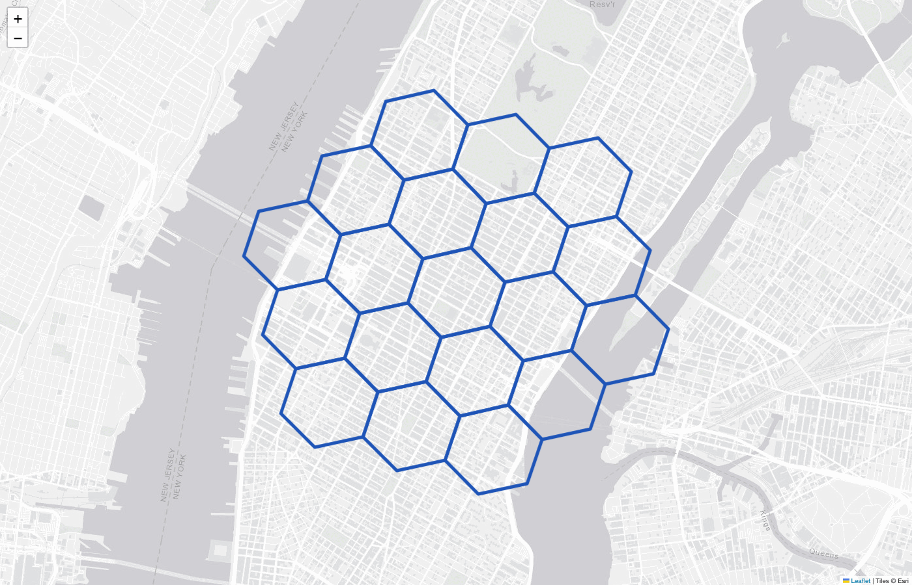
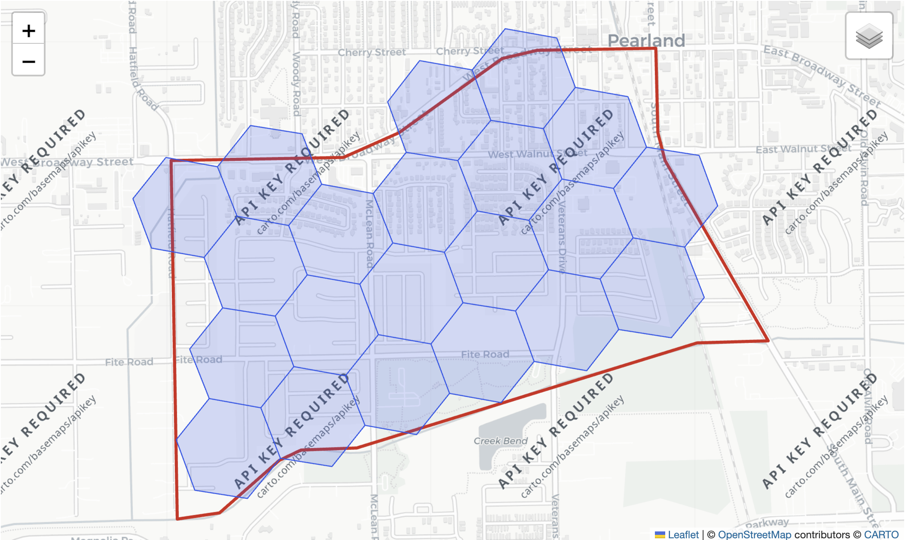

# Graphing with Folium

Polars H3 includes optional helpers for visualizing H3 cells on an
interactive Folium map. Install Folium for coverage and outline maps;
metric-colored fills additionally require Matplotlib:

```bash
pip install folium
# Optional, for plot_hex_fills:
pip install matplotlib
```

## `plot_hex_outlines`

Plot hexagon outlines on a Folium map.

```python
plot_hex_outlines(
    df: pl.DataFrame,
    *,
    hex_id_col: str,
    map: Any | None = None,
    outline_color: str = "red",
    map_size: Literal["medium", "large"] = "medium",
) -> Any
```

**Parameters**

- **df** : pl.DataFrame  
  A DataFrame that must contain a column of H3 cell IDs.
- **hex_id_col** : str  
  Column name in `df` containing H3 cell IDs (hexagon identifiers).
- **map** : folium.Map or None  
  An existing Folium map object on which to plot. If `None`, a new map is created.
- **outline_color** : str  
  Color used to outline the hexagons. Defaults to `"red"`.
- **map_size** : `{"medium", "large"}`  
  The size of the displayed map. `"medium"` sets width and height to 50%; `"large"` sets them to 100%.

**Returns**

- **Any**  
  A Folium map object with hexagon outlines added.

**Examples**

```python
import folium
import polars as pl
import polars_h3 as plh3

cells = (
    pl.DataFrame({"lat": [40.7580], "lng": [-73.9855]})
    .select(cell=plh3.latlng_to_cell("lat", "lng", 8))
    .select(cell=plh3.grid_disk("cell", 2))
    .explode("cell")
)

base_map = folium.Map(tiles=None)
folium.TileLayer(
    tiles=(
        "https://server.arcgisonline.com/ArcGIS/rest/services/Canvas/"
        "World_Light_Gray_Base/MapServer/tile/{z}/{y}/{x}"
    ),
    attr="Tiles &copy; Esri",
    name="Light Gray Canvas",
).add_to(base_map)

my_map = plh3.graphing.plot_hex_outlines(
    cells,
    hex_id_col="cell",
    map=base_map,
    outline_color="#1E54B7",
)
my_map
```



**Errors**

- `ValueError` : If the input DataFrame is empty.
- `ImportError` : If `folium` is not installed.

---

## `plot_hex_fills`

Render filled hexagonal cells on a Folium map, colorized by a specified metric.

```python
plot_hex_fills(
    df: pl.DataFrame,
    *,
    hex_id_col: str,
    metric_col: str,
    map: Any | None = None,
    map_size: Literal["medium", "large"] = "medium",
) -> Any
```

**Parameters**

- **df** : pl.DataFrame  
  A DataFrame that must contain columns for H3 cell IDs and a metric to color by.
- **hex_id_col** : str  
  Column name containing H3 cell IDs.
- **metric_col** : str  
  Column name containing metric values for colorization.
- **map** : folium.Map or None  
  An existing Folium map object. If `None`, a new map is created.
- **map_size** : `{"medium", "large"}`  
  The size of the displayed map. `"medium"` sets 50% width/height, `"large"` sets 100%.

**Returns**

- **Any**  
  A Folium map object with filled hexagons colorized by the specified metric.

**Examples**

```python
>>> df = pl.DataFrame({
...     "hex_id": [599686042433355775, 599686042433355776],
...     "some_metric": [10.0, 42.0],
... })
>>> # 'hex_id' and 'some_metric' must be valid
>>> import polars_h3 as plh3
>>> my_map = plh3.graphing.plot_hex_fills(
...     df,
...     hex_id_col="hex_id",
...     metric_col="some_metric",
... )
>>> my_map
```


**Errors**

- `ValueError` : If the input DataFrame is empty.
- `ImportError` : If `folium` or `matplotlib` is not installed.

---

!!! note

    `plot_hex_outlines` requires Folium. `plot_hex_fills` uses both Folium and
    Matplotlib for color scaling. These packages are imported only when a
    graphing function is called.

---

## `plot_polygon_coverage`

Overlay H3 cells and their row-aligned source geometry for visual auditing.
The geometry column accepts the same WKT `String` or WKB/EWKB `Binary` values
as `polygon_to_cells`; explicit EWKB SRIDs must be 4326. The cell column may
contain one cell per row or a `List` produced directly by `polygon_to_cells`.

```python
plot_polygon_coverage(
    df: pl.DataFrame,
    *,
    geometry_col: str,
    cells_col: str,
    map: Any | None = None,
    cell_color: str = "#2563eb",
    cell_fill_opacity: float = 0.2,
    geometry_color: str = "#dc2626",
    map_size: Literal["medium", "large"] = "large",
) -> Any
```

```python
coverage_map = plh3.graphing.plot_polygon_coverage(
    state_covered,
    geometry_col="wkb_geometry",
    cells_col="h3_cells",
)
coverage_map
```



The default map deduplicates repeated geometries and cells, draws translucent
blue H3 cells and red source boundaries, fits both toggleable layers, and shows
the H3 index on hover. Null values are skipped. A valid geometry with an empty
coverage is still drawn, which makes coarse-resolution misses visible.

Coordinates must use WGS84 longitude/latitude order. Folium maps are intended
for interactive audits of moderate coverages; very large cell sets produce
large HTML output. Leaflet may display antimeridian-crossing polygons with
world-spanning bounds, so dateline visualization is currently limited even
though `polygon_to_cells` accepts those geometries.

Malformed non-null geometries and invalid non-null cells raise errors instead
of being silently omitted.
